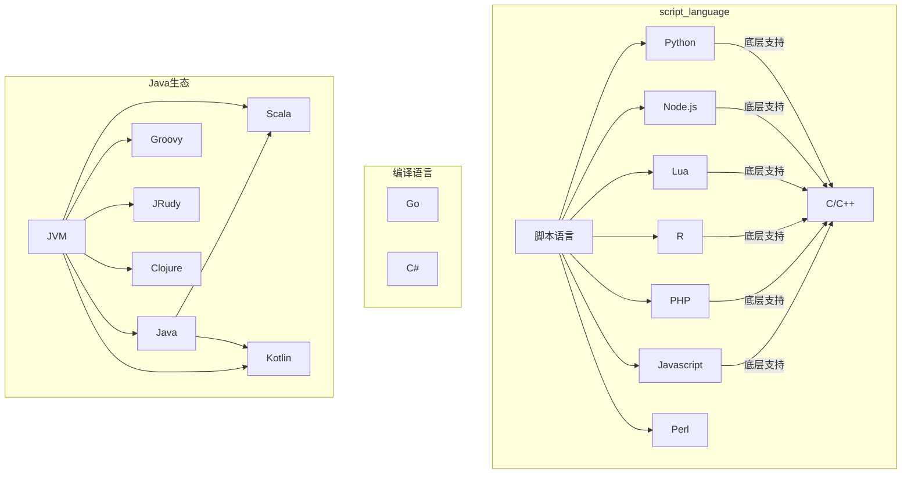

# languages-demo
Demo code of different programming languages for learning.

## 

```mermaid
graph TD
    C/C++[C/C++]
    Java[Java]
    JVM[JVM]
    Python[Python]
    Javascript[Javascript]
    Node.js[Node.js]
    Go[Go]
    Scala[Scala]
    Kotlin[Kotlin]
    PHP[PHP]
    Groovy[Groovy]
    JRudy[JRudy]
    Lua[Lua]
    Clojure[Clojure]
    C#[C#]
    script[脚本语言]

    subgraph script_language
        script --> Python
        script --> Node.js
        script --> Javascript
        script --> R
        script --> Lua
        script --> PHP
        script --> Perl
        Python-->|底层支持|C/C++
        Node.js-->|底层支持|C/C++
        Lua-->|底层支持|C/C++
        R-->|底层支持|C/C++
        PHP-->|底层支持|C/C++
        Javascript-->|底层支持|C/C++
    end

    subgraph 编译语言
        Go
        C/C++
        C#
    end

    subgraph Java生态
        JVM-->Java
        JVM-->Scala
        Java-->Scala
        Java -->Kotlin
        JVM-->Kotlin
        JVM -->Groovy
        JVM -->JRudy
        JVM -->Clojure
    end
```